// Add steps as necessary for accessing the software, post-configuration, and testing. Don’t include full usage instructions for your software, but add links to your product documentation for that information.
//Should any sections not be applicable, remove them

//== Test the deployment
// If steps are required to test the deployment, add them here. If not, remove the heading

== Post deployment steps

=== Files and Directories
Installation files are downloaded from your S3 bucket to the `/u01/install` directory. Logs and some temporary configuration files are created in `/tmp`. Files exchanged between the primary database instance and the standby database instance are placed in an NFS /shared file system. Oracle home directories are in:

*	`/u01/app/oracle/product/12c/db_1` for Oracle Database
*	`/u01/app/oracle/product/12c/grid` for Oracle Grid Infrastructure

=== Access Your Oracle Database Instance

.	Access the bastion host (created by the Quick Start template for a new VPC) or launch an EC2 instance in the public subnet, and optionally associate it with the Access Database security group (if you want access to the Oracle listener or Enterprise Manager ports). You can use SSH Agent Forwarding if the same public keys are in use.
.	From this machine, you can access the instances with SSH (port 22) or the database in the port you defined. You can use the user name “oracle” or “ec2-user” with the PEM key you defined (SSH Agent Forwarding for the private key and `orcl.dataguard-env/10.0.0.5` as the example host/address for the Oracle database hosts in the example). 

----
ssh –A oracle@orcl.dataguard-env
----

:xrefstyle: short
[#access_oracle_db_instance_1]
.Access Oracle Instance
[link=images/access_oracle_db_instance_1.png]
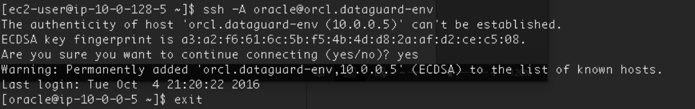

----
ssh –A oracle@10.0.0.5
----

:xrefstyle: short
[#access_oracle_db_instance_2]
.Access Oracle Instance
[link=images/access_oracle_db_instance_2.png]
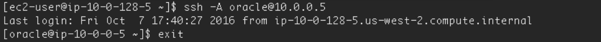

If you have an X terminal such as http://mobaxterm.mobatek.net/[MobaXterm], you can start Java utilities like DBCA and NETCA to manage your EC2 Oracle instance. Database instances are already configured with X11 Linux graphic packages.

:xrefstyle: short
[#access_oracle_db_instance_3]
.Access Oracle Instance
[link=images/access_oracle_db_instance_3.png]
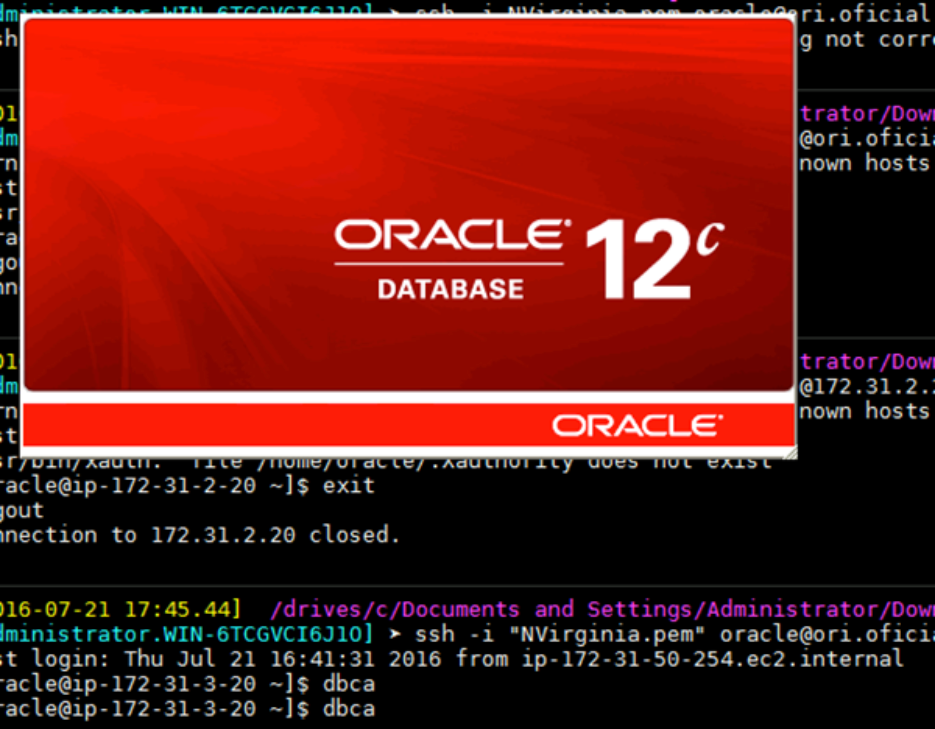

You can also access port 5500 via a browser by using `system` or `sys users` with the password you set, with `https://ip:5500/em/login` (for example, `https://172.31.3.20:5500/em/login`).

:xrefstyle: short
[#access_oracle_db_instance_4]
.Access Oracle Instance
[link=images/access_oracle_db_instance_4.png]
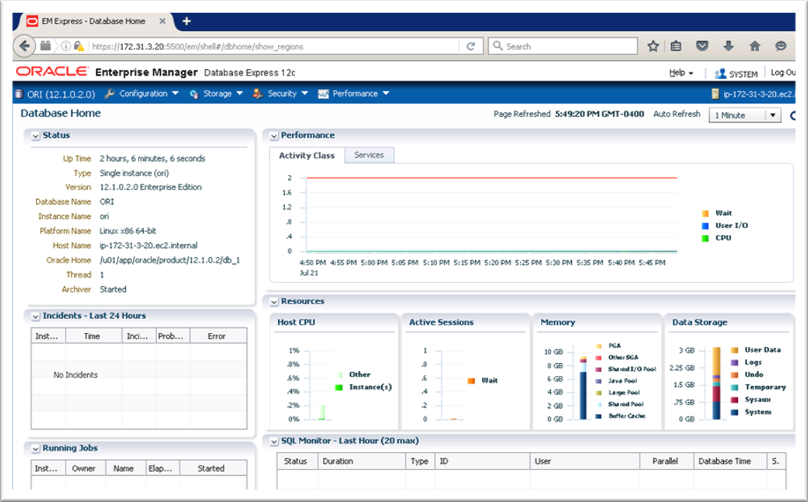

=== Check Your Environment
To check whether the standby database has been set up and the logs are in sync, log in to the primary database and force a log switch. This creates an archived log that is shipped to the standby database.

----
# ssh –A oracle@orcl.dataguard-env
# sqlplus / as sysdba   
set pages 1000 line 150
alter system switch logfile;
ALTER SESSION SET nls_date_format='DD-MON-YYYY HH24:MI:SS';
SELECT sequence#, first_time, next_time, applied FROM   v$archived
----

:xrefstyle: short
[#check_environment_1]
.Check Your Environment
[link=images/check_environment_1.png]
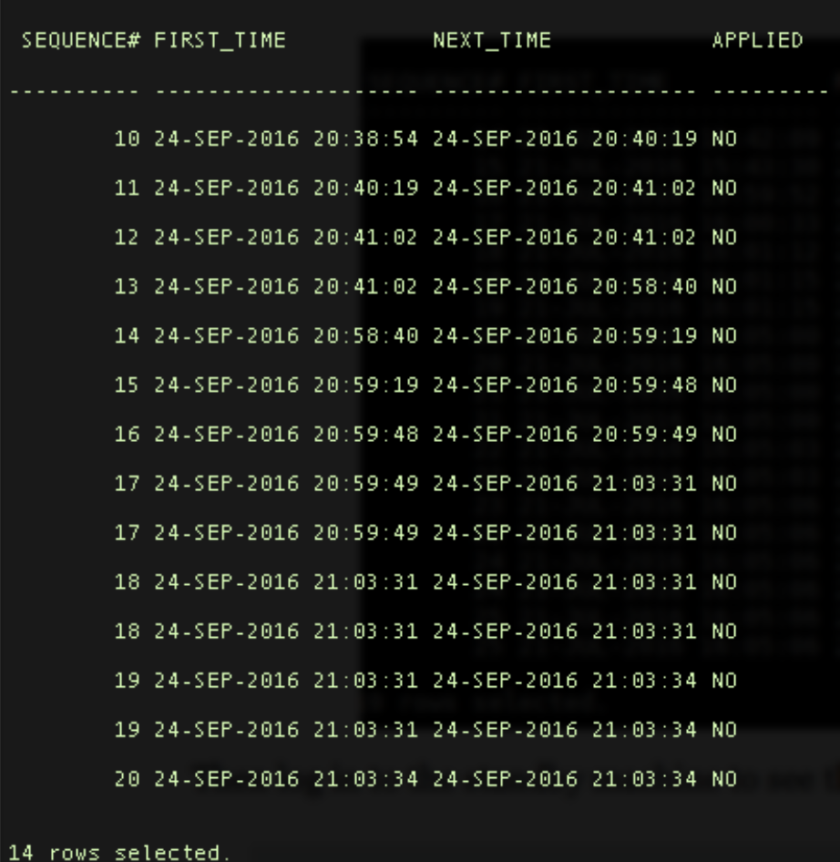

Then log in to the standby machine to see the applied logs generated.
----
# ssh –A oracle@orcl.dataguard-env 
# sqlplus / as sysdba
set pages 1000 line 150
ALTER SESSION SET nls_date_format='DD-MON-YYYY HH24:MI:SS';
SELECT sequence#, first_time, next_time, applied FROM   v$archived_log ORDER BY sequence#;
----

:xrefstyle: short
[#check_environment_2]
.Check Your Environment
[link=images/check_environment_2.png]
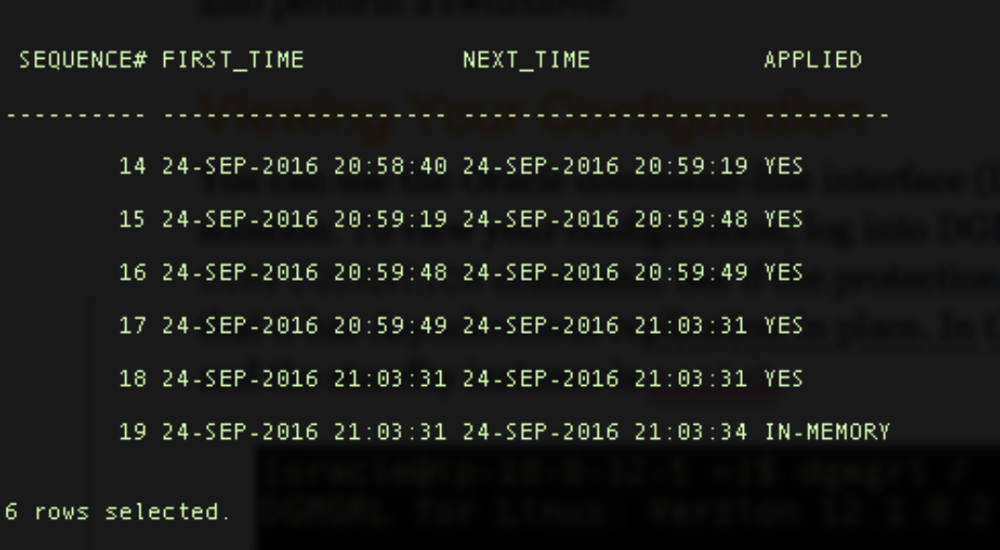

== Best practices for using {partner-product-name} on AWS

=== Working with Oracle Data Guard

After completing the deployment, you can change Oracle Data Guard configurations and also perform a switchover.

==== Viewing Your Configuration

You can use the Oracle command-line interface (DGMGRL) to administer your Data Guard solution. To view your configuration, log into DGMGRL and use the `SHOW CONFIGURATION` command. See if the protection mode is `MaxPerformance`, which means that it has asynchronous replication in place. In this example, the primary instance is `orcl` and the standby instance is `orclsb`.

:xrefstyle: short
[#view_config_1]
.Viewing Your Configuration
[link=images/view_config_1.png]
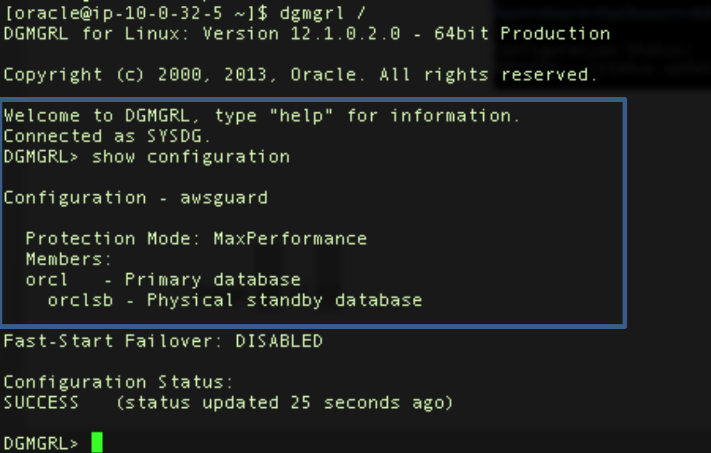

For a more detailed view, you can show the database replication configurations. In the following example, notice that LogXptMode='async'.

----
# dgmgrl sys/pass@instance 
show database verbose 'databasename';
----

:xrefstyle: short
[#view_config_2]
.Viewing Your Configuration
[link=images/view_config_2.png]
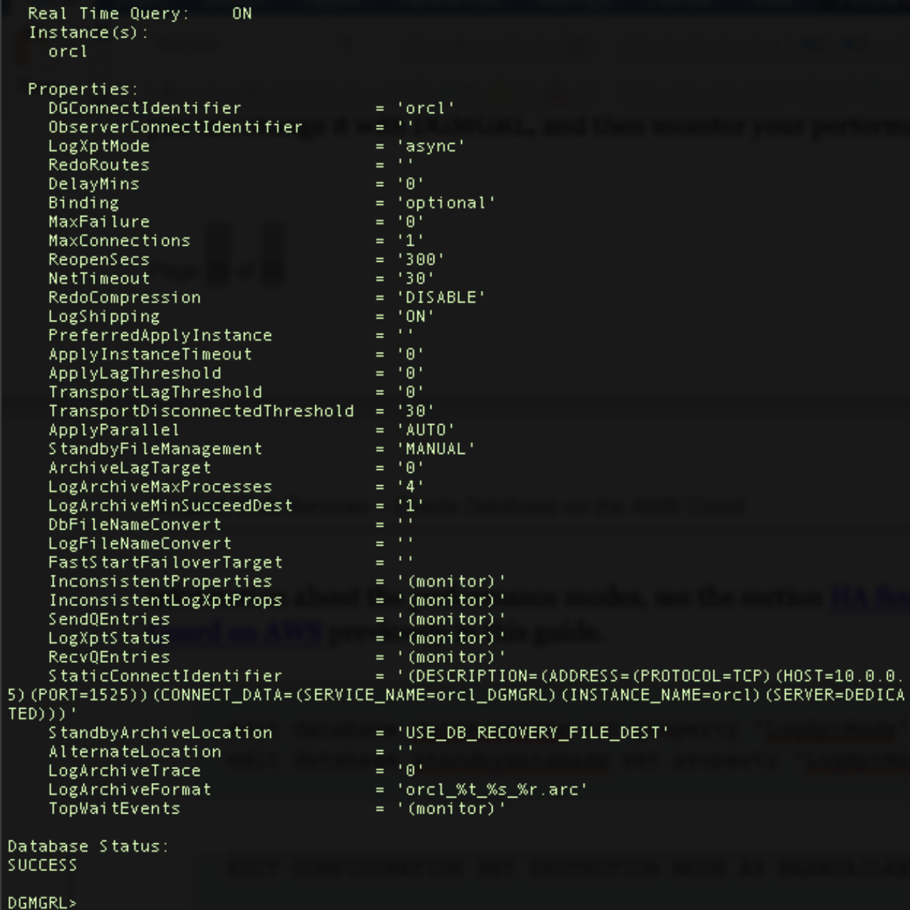

==== Changing Your Configuration
If you would like to change the protection mode from maximum performance (`MaxPerformance`) to maximum availability (`MaxAvailability`) for synchronous replication, you can change it with DGMGRL, and then monitor your performance. This will set up synchronous replication from the primary database (`orcl`) to the standby database (`orclsb`) with the lowest recovery point objective (RPO) in the event of primary database failure.

----
edit database databasename set property 'LogXptMode'='sync';
edit database standbydatabase set property 'LogXptMode'='sync';

EDIT CONFIGURATION SET PROTECTION MODE AS MAXAVAILABILITY;
----

:xrefstyle: short
[#change_config_1]
.Changing Your Configuration
[link=images/change_config_1.png]
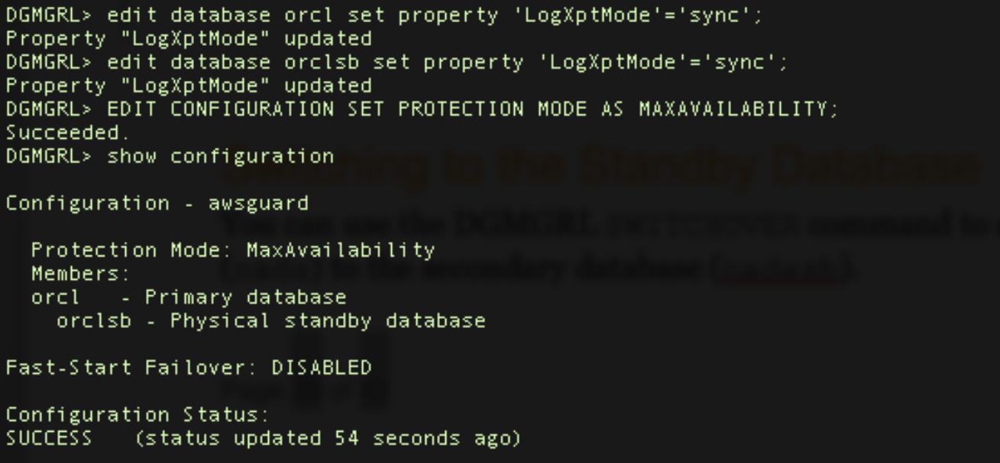

For more information about performance modes, see the section link:#_ha_scenarios_with_oracle_data_guard_on_aws[HA Scenarios with Oracle Data Guard on AWS] previously in this guide.

==== Switching to the Standby Database
You can use the DGMGRL SWITCHOVER command to switch from the primary database (`orcl`) to the secondary database (`orclsb`).

:xrefstyle: short
[#switching_to_standby_db_1]
.Switching to the Standby Database
[link=images/switching_to_standby_db_1.png]
image::../images/switching_to_standby_db_1.png[switching_to_standby_db_1,width=648,height=439]

If you have not logged in with the SYS password, you may receive the following error. 

:xrefstyle: short
[#switching_to_standby_db_2]
.Switching to the Standby Database
[link=images/switching_to_standby_db_2.png]
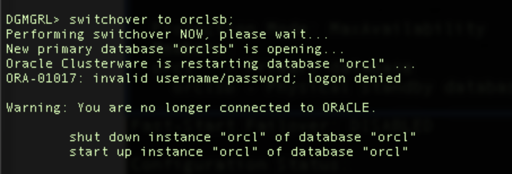

After the primary orcl instance is shut down and started back up, you may see the configuration switchover.
 
:xrefstyle: short
[#switching_to_standby_db_3]
.Switching to the Standby Database
[link=images/switching_to_standby_db_3.png]
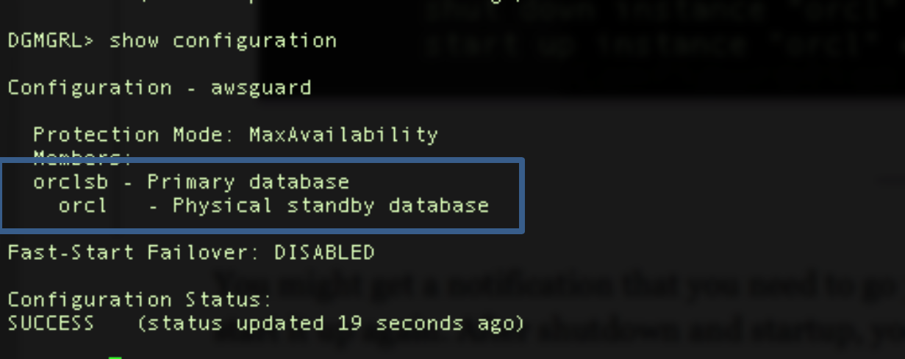

If you are logged in with the SYS password, you may fail over without the need for manual shutdown and startup.
You can also enable fast-start failover by following the instructions in the https://docs.oracle.com/cd/B28359_01/server.111/b28295/cli.htm#BABEIIHD[Oracle documentation].

==== Switching Your DNS Configuration
When you switch over to the standby database, you should also update your record set in the Amazon Route 53 private hosted zone to point to the standby database:

.	Sign in to the AWS Management Console and open the Amazon Route 53 console at https://console.aws.amazon.com/route53/.   
.	Find your IP record inside your private hosted zone and change it to your standby (new primary) IP, so your application can continuously reach your primary database on the private hosted zone, and then save the record.

:xrefstyle: short
[#switch_dns_config_1]
.Switching Your DNS Configuration
[link=images/switch_dns_config_1.png]
image::../images/switch_dns_config_1.png[switch_dns_config_1,width=648,height=439]

== Security
When you deploy systems on the AWS Cloud, security responsibilities are shared between you and AWS. AWS operates, manages, and controls the components from the host operating system and virtualization layer down to the physical security of the facilities in which the services operate. In turn, you assume responsibility and management of the guest operating system (including updates and security patches), other associated application software such as Oracle Database and Oracle Grid Infrastructure, as well as the configuration of the AWS-provided security group firewall. For more information about security on AWS, visit the https://aws.amazon.com/security/[AWS Security Center].

=== Network Security
The default network security setup of this solution follows AWS security best practices. The provisioned Oracle Database instances are deployed in private subnets and can only be accessed in three ways:

*	By connecting to the bastion host instance by using an SSH terminal.
*	From AWS resources (such as EC2, RDS, or other instances) that you might have in the `OracleServerAccessSecurityGroup` security group, or that you might launch using the security group. You may include your application instance in this security group.
*	By including new rules in `OracleServerSecurityGroup` to allow access to your database from a known IP block CIDR; for example, you might add an inbound rule to enable the VLAN 10.50.10.0/24 in your data center to connect through a VPN or AWS Direct Connect.

:xrefstyle: short
[#network_security_1]
.Adding inbound rules to your security group
[link=images/network_security_1.png]
image::../images/network_security_1.png[network_security_1,width=648,height=439]

=== OS Security
To gain root access to your instances you may use ec2-user or oracle user, and then sudo to root.

You have to keep the Amazon EC2 PEM key you are using secure in your environment. Also, keep in mind that AWS doesn’t store your keys, so if you lose your key, you may not be able to access your instances.

=== Security Groups
A security group acts as a firewall that controls the traffic for one or more instances. When you launch an instance, you associate one or more security groups with the instance. You add rules to each security group that allow traffic to or from its associated instances. You can modify the rules for a security group at any time. The new rules are automatically applied to all instances that are associated with the security group. 

This Quick Start creates three security groups: `OracleServerAccessSecurityGroup`, `OracleServerSecurityGroup`, and `OracleServersSecurityGroup`. After the Quick Start deployment, you are responsible for maintaining these security groups and including or excluding rules.

*	`OracleServerSecurityGroup` is used to grant the bastion hosts access to port 22 of the Oracle instances.
*	`OracleServersSecurityGroup` is used only for communications between database instances: primary and standby instances on database ports, SSH, and NFS ports.
*	`OracleServerAccessSecurityGroup` gives EC2 instances access to your database on the port you set up for database listeners, and on port 5500 for Oracle Enterprise Manager. 

== Other useful information

=== Migrating Your Data to AWS
AWS provides several services that you can use to migrate your data to your Oracle Database installation. These are described briefly in the following sections. For detailed information, see the whitepaper https://d0.awsstatic.com/whitepapers/strategies-for-migrating-oracle-database-to-aws.pdf[Strategies for Migrating Oracle Databases to AWS]. 

==== AWS Database Migration Service 
AWS Database Migration Service (AWS DMS) helps you migrate your databases to AWS with virtually no downtime. All data changes to the source database that occur during the migration are continuously replicated to the target, allowing the source database to be fully operational during the migration process. After the database migration is complete, the target database remains synchronized with the source for as long as you choose, allowing you to switch the database over at a convenient time. 

AWS DMS makes it easy to load your tables from your local database to your database in AWS. You can migrate your Oracle Database with multiple parallel tasks, by using an internet link (VPN connection) or a dedicated 1-Gbps or 10-Gbps connection (AWS Direct Connect). 

For more information about AWS DMS, see the https://aws.amazon.com/dms/[AWS website].

==== AWS Snowball 
AWS Snowball, which is a feature of AWS Import/Export, addresses common challenges with large-scale data transfers, including high network costs, long transfer times, and security concerns. Transferring data with Snowball is simple, fast, secure, and can cost as little as one-fifth the cost of high-speed internet.

With Snowball, you don’t need to write any code or purchase any hardware to transfer your data. Create a job in the AWS Management Console, and a Snowball appliance will be automatically shipped to you. Copy your data to the appliance (it will be encrypted), and then ship it back. The data will be loaded to Amazon S3 on AWS and made accessible from your instances.

For more information about AWS Snowball, see the https://aws.amazon.com/importexport/[AWS website].

==== Oracle RMAN Backup and Restore 
You can use the Oracle Recovery Manager (RMAN) to back up your data, send the backup files to AWS through AWS Snowball, or by using VPN or AWS Direct Connect, and restore your database on AWS. 
For more information about Oracle RMAN, see the https://docs.oracle.com/cd/E11882_01/backup.112/e10642/rcmquick.htm#BRADV89346[Oracle documentation].

==== Oracle Data Pump 
You can use Oracle Data Pump to perform network export/import operations, or send your dump file to the Oracle machines or to Amazon S3 for import operation.
For more information about Oracle Data Pump, see the https://docs.oracle.com/database/121/SUTIL/GUID-501A9908-BCC5-434C-8853-9A6096766B5A.htm[Oracle documentation].

=== Backing Up Your Data
After you deploy Oracle Database on AWS, you'll want to perform and schedule your database backups. The following sections describe some of the backup options available to  you. If you have a production database, we recommend that you set up a backup strategy and implement it as quickly as possible.

==== Oracle Secure Backup
If you chose to install the Oracle Secure Backup Cloud Module, the Quick Start performs an initial, complete backup of your database to the S3 bucket you specified in the Quick Start parameters. 

Amazon S3 is the perfect place to save your backups, because it is durable, highly available, and cost-effective, and it has a high throughput to your instances. 

After deploying the Quick Start, access your machine and view the Amazon S3 log to see the RMAN backup:

:xrefstyle: short
[#osb_1]
.Oracle Secure Backup
[link=images/osb_1.png]
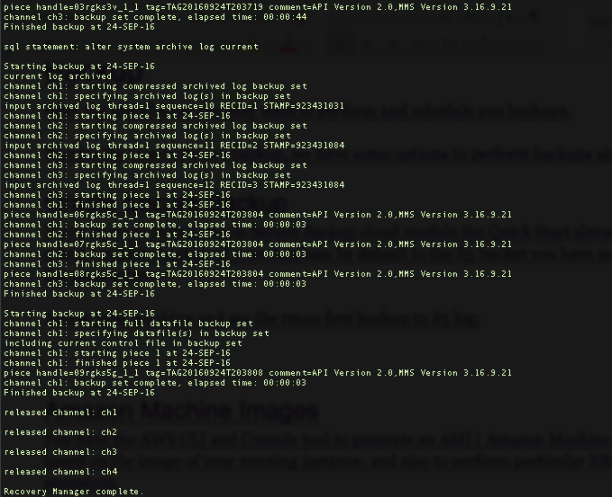

You can use the */tmp/rmanbackup.cmd* script to perform new backups or to schedule backup tasks and customize the settings for your needs.

----
rman cmdfile=/tmp/rmanbackup.cmd log=/tmp/rmanbackup.log
----

:xrefstyle: short
[#osb_2]
.Oracle Secure Backup
[link=images/osb_2.png]
image::../images/osb_2.png[osb_2,width=648,height=439]

You can also schedule your backups by using Crontab or another scheduling tool.

==== Backups to Disk and Amazon S3
You can perform backups to disk, create and attach a new Amazon EBS volume, create a new file system for local backup, and then copy the backup files by using the AWS CLI http://docs.aws.amazon.com/cli/latest/reference/s3/cp.html[`cp`] or http://docs.aws.amazon.com/cli/latest/reference/s3/sync.html[`sync`] command.

To use `cp` for individual files:
----
aws s3 cp /localfilesystem/backuppiece.bkp s3://YOURBUCKET/KEY/DB/
----

To use `cp` for a folder:
----
aws s3 cp /localfilesystem/backupfolder/ s3://YOURBUCKET/KEY/BACKUP/ --recursive
----

For more information about creating new EBS volumes and file systems, see the http://docs.aws.amazon.com/AWSEC2/latest/UserGuide/ebs-using-volumes.html[AWS documentation]. 

==== AMIs and Snapshots
You can use the AWS CLI to generate an Amazon Machine Image (AMI) based on the image of your running instance, and to take snapshots of EBS volumes.

IMPORTANT: We recommend that you shut down your database instances before creating an AMI or taking EBS snapshots.

After you create an AMI, you can launch it as a new instance. AWS will assign it a new private IP address, unless you specify your own IP address. If you move your instance to another VPC or another AWS Region, AWS might change its IP address. If so, follow these steps to change the IP address after launching the instance:

.	Edit the following files to reflect the correct IP and host names:
----
/u01/app/oracle/product/12.1.0.2/grid/network/admin/listener.ora
/u01/app/oracle/product/12.1.0.2/db_1/network/admin/tnsnames.ora 
/etc/hosts
----

[start=2]
.	Run the following command to update the installation:
----
sudo su – 
cd /u01/app/oracle/product/12.1.0.2/grid/crs/install 
perl roothas.sh -deconfig -force 
cd /u01/app/oracle/product/12.1.0.2/grid 
./root.sh
cd /u01/app/oracle/product/12.1.0.2/grid/bin 
./srvctl add asm 
./srvctl add listener 
./srvctl start asm 
----

[start=3]
.	As an Oracle user with ASM environment variables loaded, connect to asmcmd and mount the DATA and RECO disk groups. 
----
$. oraenv
+ASM
asmcmd
mount data
mount reco
----

:xrefstyle: short
[#amis_snapshots_1]
.AMIs and Snapshots
[link=images/amis_snapshots_1.png]
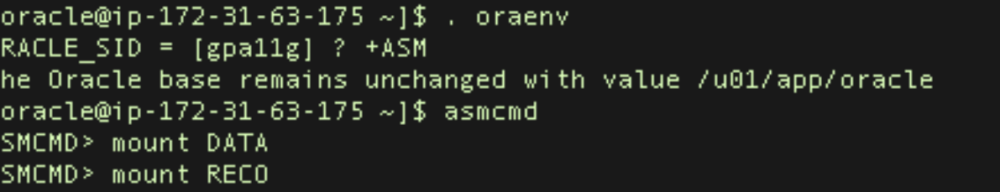

=== Additional Resources

==== AWS Services

*	AWS CloudFormation
**	Documentation:
https://aws.amazon.com/documentation/cloudformation/ 
**	Helper scripts:
https://docs.aws.amazon.com/AWSCloudFormation/latest/UserGuide/cfn-helper-scripts-reference.html
*	Amazon EBS
**	User guide: https://docs.aws.amazon.com/AWSEC2/latest/UserGuide/AmazonEBS.html 
**	Volume types: https://docs.aws.amazon.com/AWSEC2/latest/UserGuide/EBSVolumeTypes.html   
**	Optimized instances: https://docs.aws.amazon.com/AWSEC2/latest/UserGuide/EBSOptimized.html
*	AWS Command Line Interface installation on Linux
https://docs.aws.amazon.com/cli/latest/userguide/installing.html#install-with-pip
*	Amazon EC2 user guide for Linux
https://docs.aws.amazon.com/AWSEC2/latest/UserGuide/
*	Amazon Route 53
https://aws.amazon.com/documentation/route53/ 
*	Amazon S3
https://aws.amazon.com/documentation/s3/ 
*	Amazon VPC
https://aws.amazon.com/documentation/vpc/ 

==== Red Hat Enterprise Linux documentation
*	Swap space
https://access.redhat.com/documentation/en-US/Red_Hat_Enterprise_Linux/6/html/Storage_Administration_Guide/ch-swapspace.html 
*	xorg-x11 drivers packages
https://access.redhat.com/documentation/en-US/Red_Hat_Enterprise_Linux/6/html/6.4_Technical_Notes/xorg-x11.html

==== Oracle Database documentation
*	Oracle Database Installation Guide
https://docs.oracle.com/database/121/LADBI/toc.htm
*	Oracle Grid Infrastructure Installation Guide
https://docs.oracle.com/cd/E11882_01/install.112/e48194/app_nonint.htm#CWWIN417
*	Oracle Data Guard Command-Line Interface Reference
https://docs.oracle.com/database/121/DGBKR/dgmgrl.htm#DGBKR585
*	Oracle Data Guard Concepts and Administration
https://docs.oracle.com/database/121/SBYDB/concepts.htm#SBYDB00010
*	Oracle ASMLib documentation
http://www.oracle.com/technetwork/topics/linux/asmlib/index-101839.html
*	Oracle ASMLib downloads for RHEL 7
http://www.oracle.com/technetwork/server-storage/linux/asmlib/rhel7-2773795.html

==== Oracle on AWS
*	Advanced Architectures for Oracle Database on Amazon EC2
https://d0.awsstatic.com/enterprise-marketing/Oracle/AWSAdvancedArchitecturesforOracleDBonEC2.pdf
*	Best Practices for Running Oracle Database on AWS
https://d0.awsstatic.com/whitepapers/best-practices-for-running-oracle-database-on-aws.pdf
*	Strategies for Migrating Oracle Database to AWS
https://d0.awsstatic.com/whitepapers/strategies-for-migrating-oracle-database-to-aws.pdf
*	RDBMS in the Cloud: Oracle Database on AWS
https://d0.awsstatic.com/whitepapers/aws-rdbms-oracle.pdf
*	Amazon RDS for Oracle Database
https://aws.amazon.com/rds/oracle/ 

==== Oracle support notes
Access to the following documents requires an Oracle account.

*	OSB Cloud Module - FAQ (Doc ID 740226.1)
https://support.oracle.com/epmos/faces/DocumentDisplay?id=740226.1 
*	Requirements for Installing Oracle Database 12.1 on RHEL7 or OL7 64-bit (x86-64) (Doc ID 1961997.1)
https://support.oracle.com/epmos/faces/DocumentDisplay?id=1961997.1 
*	Master Note of Linux OS Requirements for Database Server (Doc ID 851598.1)
https://support.oracle.com/epmos/faces/DocumentDisplay?id=851598.1 

== Appendix A
=== Data Replication Between AWS Regions

For the greatest fault tolerance and stability, you can set up a Data Guard copy of your primary database in another AWS Region. This is a common disaster recovery scenario.

This copy must be replicated asynchronously, considering the latency caused by the distance between Regions. Asynchronous replication avoids performance impact in your primary database, which are probably connected to each to standby database through a VPN connection. 

For this scenario, you should also consider replicating your backup objects in an S3 bucket to make them available in more than one Region using cross-Region replication.

:xrefstyle: short
[#appendix_a_1]
.Data Replication Between AWS Regions
[link=images/appendix_a_1.png]
image::../images/appendix_a_1.png[appendix_a_1,width=648,height=439]

== Appendix B 
=== Adding Disks to ASM Disk Groups 

After deployment, you might need more space for data files or archived log files. To gain more space, you can add EBS volumes to your DATA and RECO disk groups.

. Create a new EBS volume in the Availability Zones in which you deployed your primary and standby instances. 

[#appendix_b_1]
.Adding Disks to ASM Disk Groups 
[link=images/appendix_b_1.png]
image::../images/appendix_b_1.png[appendix_b_1,width=648,height=439]

[start=2]
. Attach the new volumes to your instances. Take note of the last letter of the device name (for example, for /dev/sdl, the last letter is  l, and will appear in the OS as /dev/xvdl).

[#appendix_b_2]
.Adding Disks to ASM Disk Groups 
[link=images/appendix_b_2.png]
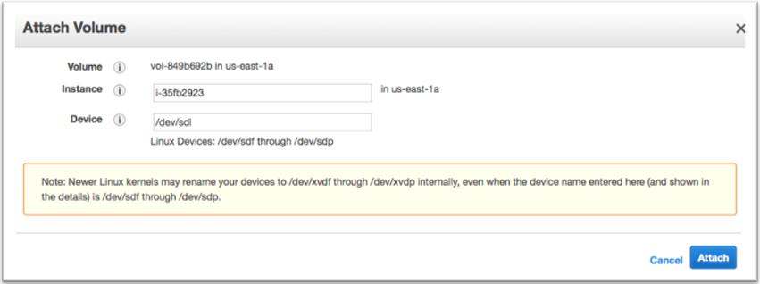

[start=3]
.	Log in to your instances and create a primary partition for the device:

----
sudo fdisk /dev/xvdl
n    (new partition)
p    (primary )
<enter>   (default  1 )
<enter>  (default xxx) 
w    (write partition)
----

[#appendix_b_3]
.Adding Disks to ASM Disk Groups 
[link=images/appendix_b_3.png]
image::../images/appendix_b_3.png[appendix_b_3,width=648,height=439]

[start=4]
. Make the partition available to ASM with a name; for example, DATA7. As an Oracle user, add the disk to the corresponding disk group:

----
sudo /etc/init.d/oracleasm createdisk DATA7 /dev/xvdl1
----

[#appendix_b_4]
.Adding Disks to ASM Disk Groups 
[link=images/appendix_b_4.png]
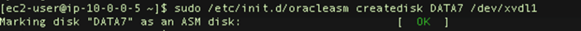

----
sudo su – oracle
. oraenv 
+ASM
sqlplus / as sysasm
alter diskgroup data add disk 'ORCL:DATA7'; 
----

[#appendix_b_5]
.Adding Disks to ASM Disk Groups 
[link=images/appendix_b_5.png]
image::../images/appendix_b_5.png[appendix_b_5,width=648,height=439]