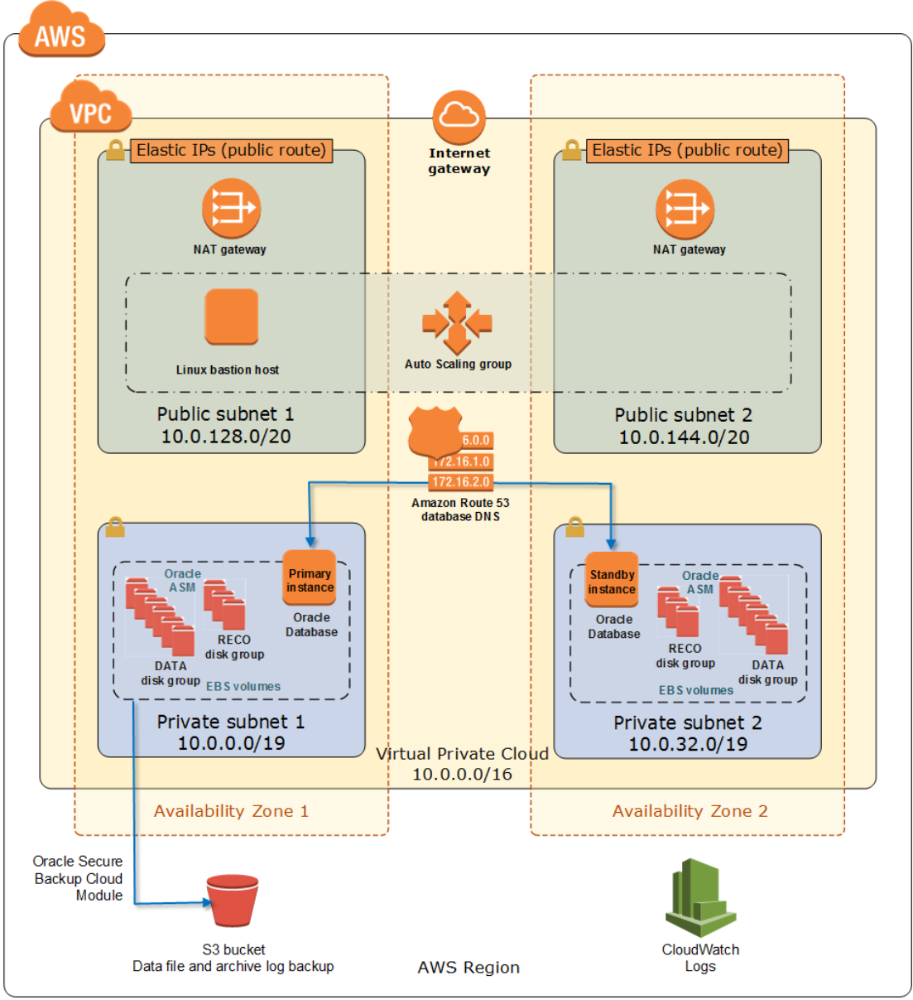

Deploying this Quick Start for a new virtual private cloud (VPC) with
*default parameters* builds the following _{partner-product-name}_ environment in the
AWS Cloud.

// Replace this example diagram with your own. Send us your source PowerPoint file. Be sure to follow our guidelines here : http://(we should include these points on our contributors giude)
:xrefstyle: short
[#architecture1]
.Quick Start architecture for _{partner-product-name}_ on AWS
[link=images/architecture_diagram.png]

As shown in <<architecture1>>, the Quick Start deploys the Oracle primary database (using the preconfigured, general-purpose starter database from Oracle) on an Amazon EC2 instance in the first Availability Zone. It then sets up a second EC2 instance in a second Availability Zone, copies the primary database to the second instance by using the DUPLICATE command, and configures Oracle Data Guard. (The template that deploys the Quick Start into an existing VPC skips the tasks marked by asterisks.)

*	A highly available architecture that spans two Availability Zones.*
*	A VPC configured with public and private subnets according to AWS best practices, to provide you with your own virtual network on AWS.* 
*	An internet gateway to allow access to the internet. This gateway is used by the bastion hosts to send and receive traffic.*
*	Managed NAT gateways to allow outbound internet access for resources in the private subnets. Database instances use this layer to securely download Linux packages required for Oracle installation.*
*	A Linux bastion host in each public subnet with an Elastic IP address to allow inbound Secure Shell (SSH) access to EC2 instances in public and private subnets.*
*	Three security groups for fine-grained inbound access control from the bastion host, between the database instances, and for application access to the database.
*	AWS Command Line Interface (AWS CLI) and an instance role for installation bucket access.
*	The Amazon Route 53 Domain Name System (DNS) web service to provide independency from using IP addresses or server host names. This is useful in failover or switchover scenarios.
*	A set of solid state drive (SSD) disks—six for ASM data (DATA) disk groups, and three for recovery (RECO) disk groups—which can be set to Provisioned IOPS (io1) volumes. 

The Quick Start can also integrate with an existing Amazon S3 bucket, which helps you store backups and archive logs in a very cost-effective way. You can also use Oracle Secure Backup library commands to interact directly with Oracle Recovery Manager (RMAN).

