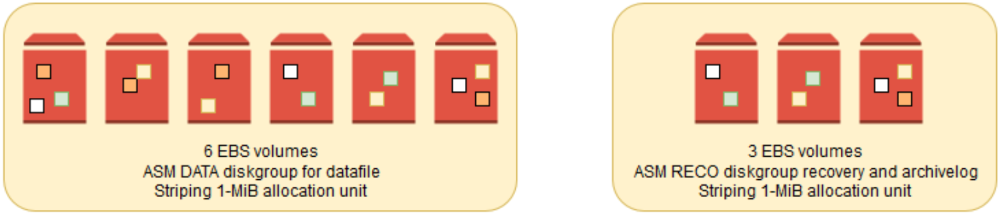

// There are generally two deployment options. If additional are required, add them here

This Quick Start provides two deployment options:

* *Deploy {partner-product-name} into a new VPC (end-to-end deployment)*. This option builds a new AWS environment consisting of the VPC, subnets, NAT gateways, security groups, bastion hosts, and other infrastructure components. It then deploys {partner-product-name} into this new VPC.
* *Deploy {partner-product-name} into an existing VPC*. This option provisions {partner-product-name} in your existing AWS infrastructure.

The Quick Start provides separate templates for these options. It also lets you configure Classless Inter-Domain Routing (CIDR) blocks, instance types, and {partner-product-name} settings, as discussed later in this guide.

=== Oracle Database 12c Editions

This Quick Start requires Oracle Database 12c Enterprise Edition.

In Oracle Database 12c Enterprise Edition, you can choose to use the standard Linux file system (e.g., ext4) or Automatic Storage Management (ASM) to store your data files, redo logs, and archived logs. This Quick Start deploys an ASM infrastructure, which provides better performance and file management than the standard Linux file system. Oracle ASM supports automatic file management and data striping across multiple EBS volumes, providing high performance and an easy way to scale your storage area.

:xrefstyle: short
[#installation_summary]
.Installation Summary for _{partner-product-name}_ on AWS
[link=images/installation_summary.png]
image::../images/installation_summary.png[installation_summary,width=648,height=439]

=== Operating System for Deployment

You can use Linux or Microsoft Windows for your Oracle Database installation on AWS. This Quick Start deployment uses Linux. The Quick Start supports Red Hat Enterprise Linux (RHEL) version 7.2 and Oracle Linux 7.3.

=== Storage Management

This Quick Start uses Oracle ASM as the storage layer of the virtual machine, because ASM helps you add and reduce capacity easily. ASM’s striping feature, which spreads data across multiple disks in 1-MiB blocks, also supports distributed I/O across all the EBS volumes.  

:xrefstyle: short
[#asm_disk_groups]
.ASM Disk Groups
[link=images/asm_disk_groups.png]

This Quick Start gives you a choice of General Purpose SSD (gp2) volumes or Provisioned IOPS SSD (io1) volumes.

Setting an ASM disk group to several gp2 volumes provides a burst capability per EBS volume of up to 3,000 IOPS, which means 18,000 IOPS for a six-volume DATA disk group and 9,000 IOPS for a three-volume RECO disk group, even with disks as small as 1 GiB.

For sustained IOPS, each 1-GiB gp2 volume delivers 3 IOPS until the maximum of 16,000 IOPS is reached. Also certain large EC2 instances can support maximum of 80,000 IOPS. Refer to Amazon EBS–optimized instances for additional information on maximum IOPS supported by each instance type. So with our six-volume data disks, the maximum I/O throughput is achieved with 4,444 GiB volumes (x 6 = 26,667 GiB disk group) or higher volumes. 

For sustained IOPS that is higher than 3 IOPS/GiB, you can use io1 volumes. This option typically addresses the needs of critical business applications that require sustained IOPS performance or more than 16,000 IOPS or 250 MiB/s of throughput per volume, and can then achieve 500 MiB/s per volume. Provisioned IOPS instances can provide maximum throughput of 1,000 MiB/s when provisioned with more than 32,000 IOPS on Nitro system based instance types. For more information refer to Amazon EBS volume types.

If you choose Provisioned IOPS (io1) volumes, you will need to provide the amount of IOPS desired for both DATA and RECO volumes.

ASM is part of Oracle Grid Infrastructure, which is provided as a standalone download, so this Quick Start installs Oracle Grid Infrastructure followed by Oracle Database 12c.

=== Oracle Memory Configuration 

The Quick Start maps each instance type to an Oracle SGA size in megabytes (60% of available RAM in the instance) and SHMMAX kernel, using 75% of the memory available to allow further SGA growth. For more information, see the https://support.oracle.com/epmos/faces/DocumentDisplay?id=1529864.1[Oracle support document 1529864.1] (access to the document requires an Oracle account). The Quick Start provides default settings that you can revise; see the Mappings section of the AWS CloudFormation template.

[indent=2]
----
    "Mappings": {
        "AWSInstanceType2Value": {
            "t2.medium": {
                "sga": "2458",
                "shmall": "838861",
                "shmmax": "3221225472"
            },
            ...
            "t2.large": {
                "sga": "4915",
                "shmall": "1677722",
                "shmmax": "6442450944"
            },
            ...
            "r3.8xlarge": {
                "sga": "149914",
                "shmall": "51170509",
                "shmmax": "196494753792"
            },
            ...
----

=== Backup Options

The Amazon S3 service provides an easy way to handle Oracle Database backups. AWS provides large network bandwidth from the EC2 instances deployed by the Quick Start to the S3 buckets.

Oracle also provides a product called http://www.oracle.com/technetwork/database/features/availability/twp-oracledbcloudbackup-130129.pdf[Oracle Secure Backup (OSB) Cloud Module]. This product is not included in Oracle Enterprise Edition and requires a separate license with Oracle. This Quick Start gives you the option to install the OSB Cloud Module. You can use the parameters in the Oracle Secure Backup Cloud Module section of the template to configure the settings for this module, including the name of the S3 bucket for storing your Oracle Database backups, your Oracle Technology Network (OTN) account and password, and an access key and secret key for accessing the bucket. See link:#_launch_the_quick_start[Launch the Quick Start] in the deployment steps for details. To register for an OTN account, see the https://docs.oracle.com/database/121/RCMRF/web_services.htm#RCMRF90493[Oracle documentation].

For more information about Oracle Database backup options after deployment, see the link:#_backing_up_your_data[Backing Up Your Data] section later in this guide.
