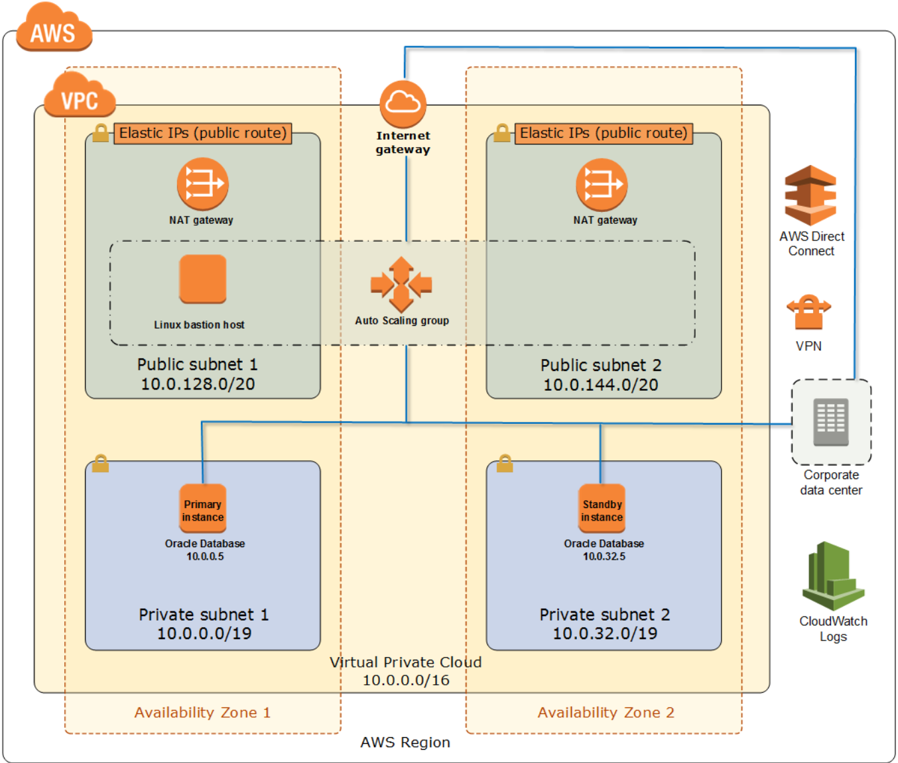

// Replace the content in <>
// Briefly describe the software. Use consistent and clear branding. 
// Include the benefits of using the software on AWS, and provide details on usage scenarios.

Companies around the world have relied on Oracle Database for their data for many years. The business requirements that make Oracle Database a popular choice include the need for a low recovery time objective (RTO) and recovery point objective (RPO) in case of a failure or disaster, to guarantee minimum business impact and to ensure customer confidence. 

Amazon Relational Database Service (Amazon RDS) for Oracle Database is the easiest way to set up, operate, and scale a highly available Oracle Database in the cloud. You can deploy multiple editions of Oracle Database, including Enterprise Edition, Standard Edition, Standard Edition 1, and Standard Edition 2, with the Bring Your Own License (BYOL) model. Amazon RDS backs up your database automatically and also applies patches within the same patchset release.

Although Amazon RDS supports most Oracle Database use cases, it restricts access to some system procedures and features that require advanced privileges. In some cases, you might want to install Oracle Database without restricting any features, privileges, storage sizes, and IOPS. For example, you might want to use over 64 TiB of storage and over 80,000 IOPS. For these higher workloads, we recommend that you install Oracle Database in an Amazon Elastic Compute Cloud (Amazon EC2) virtual computing environment. 

This Quick Start provides a reliable and automated way to install and configure your Oracle Database Enterprise Edition on Amazon EC2 with high availability. The Quick Start templates install the Oracle ASM storage management layer with the Oracle Grid Infrastructure server, and Oracle Data Guard for database setup and replication using physical standby databases. 

Oracle ASM is Oracle’s storage management solution that provides features such as disk striping, two-way and three-way mirroring, dynamic disk reconfiguration, and file management. Oracle Grid Infrastructure provides server support for Oracle Database and Oracle ASM. Oracle Data Guard provides a GUI and command-line interface for managing your primary and secondary databases. For more information about these components, see the http://docs.oracle.com/[Oracle documentation].

=== High Availability on AWS

The AWS Cloud infrastructure is global, and is built around Regions and Availability Zones. A Region is a separate geographic area where you can place AWS instances and data. For a current map of AWS Regions, see https://aws.amazon.com/about-aws/global-infrastructure/[AWS Global Infrastructure] on the AWS website. When you launch this Quick Start, you can choose the AWS Region where you would like to deploy your Oracle Database.

Each Region includes multiple Availability Zones, which are isolated locations with one or more discrete data centers—each with redundant power, networking and connectivity, housed in separate facilities. When you’re running databases on AWS, you can benefit significantly from Availability Zones, because they are connected to one another with fast, private, fiber-optic networking, providing automatic failover without interruption. 

Oracle Database high availability (HA) on AWS relies on AWS Availability Zones. The primary database and the standby database are placed in different Availability Zones, so if your primary database fails, your standby database can take over.

=== HA Scenarios with Oracle Data Guard on AWS

Oracle Data Guard is a feature of Oracle Database Enterprise Edition that provides a set of tools to manage one or more Oracle standby databases for high availability and disaster recovery. To create an Oracle standby database, you replicate the Oracle primary database to a secondary machine by applying its online or archived redo logs. 
When the standby database is set up, any changes to the primary database are replicated to the standby database, ensuring that the contents of the two databases are in sync.

The following table describes the replication methods associated with Oracle Data Guard protection modes.
[cols="3",options="header",grid=rows,frame=topbot]
|===
|Protection mode  |Replication | Behavior
|*Maximum performance* (default)
|Asynchronous
|Primary database performance is not affected by any delays writing redo data to the standby database.
|*Maximum availability* (default)
|Synchronous
|Commit occurs when all redo data needed to recover transactions has been written to the online redo log and to at least one synchronized standby database. If Data Guard is not able to write to the standby database, behavior will be similar to the maximum performance protection mode.
|*Maximum protection* (default)
|Synchronous
|Changes must be written to both the online redo log and to the standby database for every transaction. If Data Guard is unable to write the redo stream to at least one standby, it will shut down the primary instance.
|===

You can set up an Oracle primary and standby relationship between two EC2 instances in different Availability Zones in the same AWS Region for synchronous or asynchronous replication, because they are connected with high-speed links. Alternatively, you can set up asynchronous replication between primary and standby databases in different AWS Regions. This Quick Start automates the first option: replication between different Availability Zones in the same Region, as discussed in detail in the link:#_architecture[Architecture] section. If you’re interested in the replication between Regions, you can create an Amazon EC2 AMI from your standby database instance and copy it to another Region. For more information about this alternate scenario, see link:#_appendix_a[Appendix A].

=== Oracle Network Environment in AWS

To ensure a high level of security, AWS provides the Amazon Virtual Private Cloud (Amazon VPC) service, which lets you provision logically isolated sections of the AWS Cloud where you can launch AWS resources in a virtual network that you define. When you create a VPC, you specify its size in the form of a Classless Inter-Domain Routing (CIDR) block. You can define a VPC as large as a /16 CIDR block or as small as a /28 CIDR block, depending on the number of subnets and IP addresses you would like to use. For more information about VPCs and subnets, see the http://docs.aws.amazon.com/AmazonVPC/latest/UserGuide/VPC_Subnets.html[AWS documentation].

We recommend that you create databases in private subnets, and use NAT gateways for internet access. This will ensure that your databases are not exposed to the internet, but can be updated via download packages. Database subnets should be accessible from your VPN (or AWS Direct Connect connection, if you have one), and from your application subnets. This Quick Start automatically sets up a VPC based on AWS best practices. It also sets up public and private subnets, NAT gateways, and bastion hosts in an Auto Scaling group to access your database instances. 

:xrefstyle: short
[#network_planning]
.Network Planning for _{partner-product-name}_ on AWS
[link=images/network_planning.png]

If you want to establish a secure connection between your on-premises data center and your VPC, you can use a VPN connection or a dedicated network connection (AWS Direct Connect).